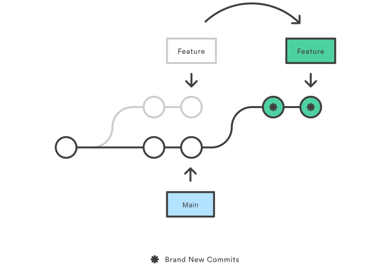

# iti-zag-dotnet3-lab2

* To delete branches locally you need to be on another branch and execute 
    ```
    git branch -d <branch_name>
    ```

* To delete a remote branch
    ``` 
    git push origin :branch_name
    ```

* **Tags (Annotated vs Lightweight)**
  * A common pattern is to use version numbers like git tag v1.4. Git supports two different types of tags, **annotated** and **lightweight** tags. The previous example created a lightweight tag. **Lightweight tags** and **Annotated tags** differ in the amount of accompanying meta data they store. A best practice is to consider `Annotated tags as public`, and `Lightweight tags as private`. `Annotated tags store extra meta data such as: the tagger name, email, and date. This is important data for a public release.` `Lightweight tags are essentially 'bookmarks' to a commit, they are just a name and a pointer to a commit, useful for creating quick links to relevant commits.`

  * To create an annotated tag for a specific commit:
    ```
    git tag -a <version> <commit-hash> -m "<tag-message>"
    ```
      e.g: 
      ```
      git tag -a v1.4 abc123 -m "This is a message for tag v1.4"
      ```

  * To create an lightweight tag for a specific commit:
    ```
    git tag <version> <commit-hash>
    ```
      e.g: 
      ```
      git tag v1.4 abc123
      ```
* **Rebasing** is the process of moving or combining a sequence of commits to a new base commit. Rebasing is most useful and easily visualized in the context of a feature branching workflow.
* You have two options for integrating your feature into the main branch: merging directly or rebasing and then merging. The former option results in a 3-way merge and a merge commit, while the latter results in a fast-forward merge and a perfectly linear history. The following diagram demonstrates how rebasing onto the main branch facilitates a fast-forward merge.

* The primary reason for rebasing is to maintain a linear project history.

* To list all tags: 
    ```
    git tag
    ```
    It also appears with its specified commit to view this:
    ```
    git commit --oneline
    ```
* To remove a tag locally:
  ```
  git tag -d
  ```
* To remove a tag remotely:
  ```
  git push origin --delete tag <tag-name>
  ```

* Bonus Task
  * I added the `rebase.svg` and a screenshot of vs code.

  